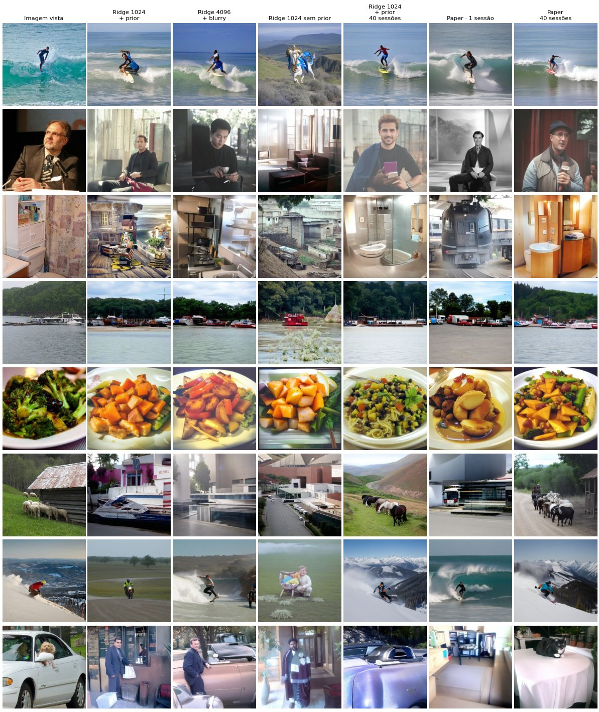
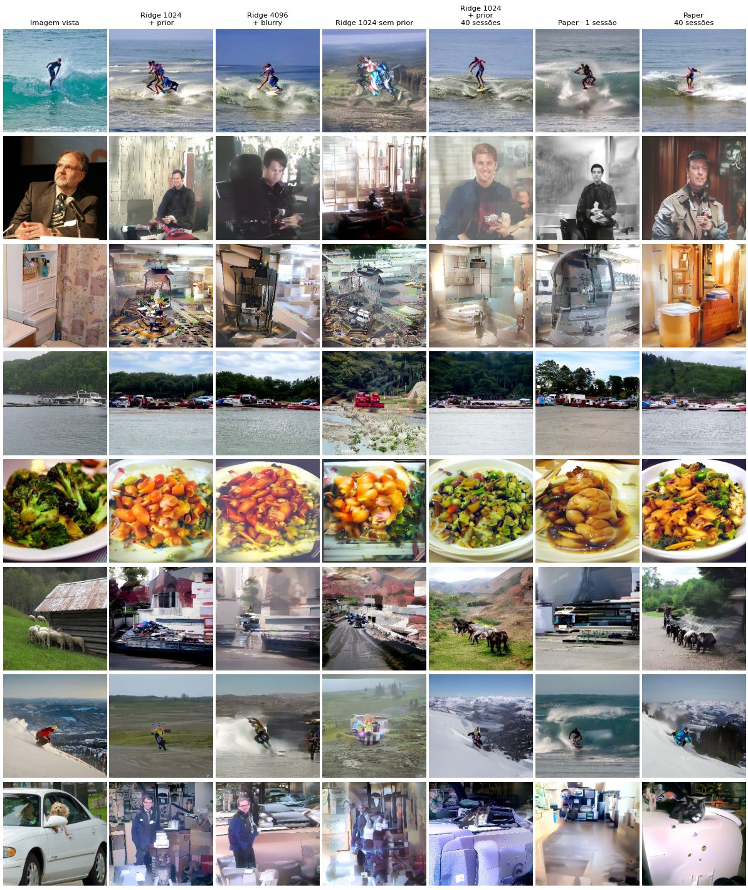

# Benchmark ridge-only

MindEye2, sujeito 1 do NSD. Quatro variações do fine-tune só da camada ridge, comparadas com os modelos publicados no artigo (fine-tune completo) e com um baseline linear (FRR) que não usa rede nenhuma. Mesmo teste (1.000 imagens), mesmo pipeline de reconstrução e mesmas métricas para todos.

A versão completa, com a galeria de reconstruções, curvas de treino e seletor refinada/unCLIP, está em [benchmark/index.html](benchmark/index.html) — um arquivo só, abre offline.

Gerado por `src/make_benchmark.py` em 01/10/2026 19:00 (commit `4021cb7`).

## Modelos

| Modelo | Sessões | hidden_dim | Blurry | Parâmetros treinados | Treino | Tempo (A4500) |
|---|---:|---:|---|---|---|---|
| FRR · 1 sessão | 1 | — | não | 6,70 bi de coeficientes (forma fechada) | 20 frações · CV 5 dobras · uma fração por dimensão | 10 s |
| FRR · 40 sessões | 40 | — | não | 6,70 bi de coeficientes (forma fechada) | 20 frações · CV 5 dobras · uma fração por dimensão | 21 min |
| Ridge 1024 + prior | 1 | 1024 | não | 16,1 M de 729,3 M (2,21%) | 150 épocas · batch 16 | ~1 h 50 (corrida anterior) |
| Ridge 4096 + blurry | 1 | 4096 | sim | 64,4 M de 2.227,3 M (2,89%) | 150 épocas · batch 8 · congelados em fp16 | 2 h 41 |
| Ridge 1024 sem prior | 1 | 1024 | não | 16,1 M de 469,5 M (3,43%) | 150 épocas · batch 16 | — |
| Ridge 1024 + prior · 40 sessões | 40 | 1024 | não | 16,1 M de 729,3 M (2,21%) | 20 épocas · batch 16 · congelados em fp16 | 7 h 51 |
| Paper · 1 sessão | 1 | 4096 | sim | todos (2.227,3 M) | 150 épocas · batch 24 · 8×A100 | — |
| Paper · 40 sessões | 40 | 4096 | sim | todos (2.227,3 M) | 150 épocas · batch 24 · 8×A100 | — |

## Resumo

- **1 sessão, mesma arquitetura do artigo.** O ridge 4096 + blurry fica à frente do fine-tune completo em 9 das 10 métricas de reconstrução e retrieval (perde só no SSIM: 0,414 contra 0,421), treinando 2,89% dos parâmetros numa GPU de 20 GB. Nas identificações 2-way a vantagem é de 1,5 a 2,2 pontos, acima dos até 0,6 ponto que mudam só por reamostrar a reconstrução. No retrieval Cér→img a distância é grande: 92,0% contra 77,6%.
- **1024 contra 4096 + blurry.** A dimensão maior e o ramo blurry pesam sobretudo no baixo nível (PixCorr 0,181 → 0,253; Alex(2) 85,4% → 89,6%). No alto nível o 1024 já empata com o artigo: Incep e CLIP a menos de 1 ponto, Eff e SwAV a 0,003.
- **O prior importa no treino da ridge.** Com o mesmo script e a mesma semente, tirar a loss do prior derruba o retrieval (Img→cér / Cér→img) de 92,9% / 88,1% para 78,4% / 72,6%, e todas as métricas de reconstrução caem junto. O retrieval nem passa pelo prior: o que muda é o sinal de treino, já que a loss do prior supervisiona a saída inteira do backbone (256 × 1.664), e não só a projeção contrastiva.
- **40 sessões.** O ridge 1024 chega a 99,9% / 99,5% de retrieval e fica de 1 a 3 pontos do artigo nas identificações 2-way (CLIP 92,3% contra 93,6%). A distância maior é no baixo nível (PixCorr 0,277 contra 0,373), onde o artigo tem o ramo blurry e este não.
- **Ruído.** Trocar a semente do treino move o retrieval em menos de 0,5 ponto; reamostrar a reconstrução move as identificações 2-way em até 0,6 ponto e o PixCorr em até 0,006. O efeito da semente do treino nas métricas de imagem não foi medido.
- **O pipeline reproduz o artigo.** Reconstruídos aqui, os dois modelos publicados ficam a até 1 ponto dos tensores divulgados pelos autores nas identificações 2-way, e a até 0,007 em PixCorr e SSIM.
- **FRR, o baseline linear.** Uma regressão linear dos voxels para o embedding CLIP, sem rede nenhuma, acha o cérebro certo de cada imagem (Img→cér) em 55,0% dos casos com 1 sessão e 96,4% com 40, contra 92,8% e 99,9% do ridge 1024 + prior: com poucos dados falta muito, e o ganho de 1 para 40 sessões é de 41 pontos no FRR e 7 no ridge. Escolher uma fração para cada dimensão do alvo é o que sustenta o resultado com pouco dado: com uma fração só para todas, o de 1 sessão cai de 55,0% para 33,2%; com 40 sessões as duas coincidem.
- **FRR e a média.** No sentido Cér→img o cosseno bruto dá só 3,1% e 37,7%, artefato de previsões encolhidas em direção à média (hubness); tirando a média de treino sobe para 31,7% e 86,5%. O embedding previsto também acrescenta pouco a ela: o cosseno com o verdadeiro vale ~0,5, quase todo pela média, e centrado fica em 0,12 e 0,22. O R² de validação cruzada é de 0,7% e 1,6% (otimista, a fração foi escolhida nas mesmas dobras), mas o retrieval só precisa do ranking.
- **FRR e a grade de frações.** Com 40 sessões, estender a grade até 0,001 (o ótimo do erro quadrático cai abaixo da de Doerig) leva o R² de validação cruzada de 1,6% para 3,2% e piora o Img→cér de 96,4% para 92,4%: o erro quadrático não é o critério do retrieval.

## Reconstrução e retrieval — refinadas

| Modelo | PixCorr ↑ | SSIM ↑ | Alex(2) ↑ | Alex(5) ↑ | Incep ↑ | CLIP ↑ | Eff ↓ | SwAV ↓ | Img→cér ↑ | Cér→img ↑ |
|---|---:|---:|---:|---:|---:|---:|---:|---:|---:|---:|
| **1 sessão · ~1 h de fMRI, 750 exibições** | | | | | | | | | | |
| FRR · 1 sessão (só retrieval, sem reconstrução) | — | — | — | — | — | — | — | — | 55,0% | 3,1% |
| Ridge 1024 + prior | 0,181 | 0,346 | 85,4% | 92,5% | 83,6% | 82,6% | 0,802 | 0,460 | 92,8% | 88,1% |
| Ridge 4096 + blurry | **0,253** | 0,414 | **89,6%** | **94,6%** | **85,2%** | **83,5%** | **0,785** | **0,443** | **95,5%** | **92,0%** |
| Ridge 1024 sem prior | 0,111 | 0,310 | 75,0% | 83,8% | 72,8% | 72,6% | 0,889 | 0,525 | 78,5% | 72,1% |
| Paper · 1 sessão (nossa execução) | 0,237 | **0,421** | 87,6% | 93,1% | 83,0% | 81,7% | 0,804 | 0,457 | 93,9% | 77,6% |
| ↳ reconstruções publicadas pelos autores | 0,235 | 0,428 | 88,0% | 93,3% | 83,6% | 80,7% | 0,798 | 0,459 | 93,9% | 77,6% |
| **40 sessões · ~40 h de fMRI, 30.000 exibições** | | | | | | | | | | |
| FRR · 40 sessões (só retrieval, sem reconstrução) | — | — | — | — | — | — | — | — | 96,4% | 37,7% |
| Ridge 1024 + prior · 40 sessões | 0,277 | 0,383 | 94,5% | 98,2% | 94,7% | 92,3% | 0,645 | 0,364 | 99,9% | 99,5% |
| Paper · 40 sessões (nossa execução) | **0,373** | **0,432** | **97,5%** | **99,2%** | **96,0%** | **93,6%** | **0,606** | **0,331** | **100,0%** | **99,9%** |
| ↳ reconstruções publicadas pelos autores | 0,374 | 0,439 | 97,8% | 99,1% | 96,1% | 93,6% | 0,609 | 0,338 | 100,0% | 99,9% |

## Reconstrução — unCLIP (sem refinar)

| Modelo | PixCorr ↑ | SSIM ↑ | Alex(2) ↑ | Alex(5) ↑ | Incep ↑ | CLIP ↑ | Eff ↓ | SwAV ↓ |
|---|---:|---:|---:|---:|---:|---:|---:|---:|
| **1 sessão · ~1 h de fMRI, 750 exibições** | | | | | | | | |
| Ridge 1024 + prior | 0,176 | 0,285 | 82,8% | 92,4% | 85,5% | 81,3% | 0,816 | 0,473 |
| Ridge 4096 + blurry | **0,214** | 0,319 | **88,1%** | **94,7%** | **87,4%** | **83,8%** | **0,794** | **0,452** |
| Ridge 1024 sem prior | 0,109 | 0,246 | 71,7% | 83,2% | 74,9% | 69,7% | 0,897 | 0,539 |
| Paper · 1 sessão (nossa execução) | 0,201 | **0,337** | 86,8% | 93,9% | 84,1% | 82,4% | 0,808 | 0,454 |
| ↳ reconstruções publicadas pelos autores | — | — | — | — | — | — | — | — |
| **40 sessões · ~40 h de fMRI, 30.000 exibições** | | | | | | | | |
| Ridge 1024 + prior · 40 sessões | 0,271 | 0,330 | 93,5% | 98,3% | 95,3% | 92,1% | 0,669 | 0,382 |
| Paper · 40 sessões (nossa execução) | **0,324** | **0,332** | **96,9%** | **99,4%** | **96,7%** | **95,1%** | **0,610** | **0,332** |
| ↳ reconstruções publicadas pelos autores | 0,325 | 0,333 | 97,2% | 99,4% | 96,8% | 94,9% | 0,611 | 0,334 |

## Correlação cerebral (GNet) — refinadas

| Modelo | nsdgeneral ↑ | V1 ↑ | V2 ↑ | V3 ↑ | V4 ↑ | Alto nível ↑ |
|---|---:|---:|---:|---:|---:|---:|
| **1 sessão · ~1 h de fMRI, 750 exibições** | | | | | | |
| Ridge 1024 + prior | 0,347 | 0,299 | 0,317 | 0,322 | 0,302 | 0,347 |
| Ridge 4096 + blurry | **0,355** | **0,329** | 0,335 | 0,336 | **0,317** | **0,352** |
| Ridge 1024 sem prior | 0,292 | 0,235 | 0,257 | 0,266 | 0,254 | 0,294 |
| Paper · 1 sessão (nossa execução) | 0,350 | 0,320 | **0,339** | **0,344** | 0,316 | 0,347 |
| ↳ reconstruções publicadas pelos autores | 0,347 | 0,318 | 0,337 | 0,341 | 0,316 | 0,345 |
| **40 sessões · ~40 h de fMRI, 30.000 exibições** | | | | | | |
| Ridge 1024 + prior · 40 sessões | 0,371 | 0,357 | 0,361 | 0,354 | 0,332 | 0,362 |
| Paper · 40 sessões (nossa execução) | **0,380** | **0,395** | **0,388** | **0,372** | **0,340** | **0,365** |
| ↳ reconstruções publicadas pelos autores | 0,374 | 0,389 | 0,381 | 0,367 | 0,337 | 0,361 |

Negrito: melhor do grupo, sem contar as reconstruções publicadas. Modelos com ramo blurry avaliam 75% refinada + 25% blurry, como no artigo.

Retrieval top-1 entre 300, média de 30 sorteios. **Img→cér** (fwd no código): para cada imagem, achar o seu cérebro entre as 300 previsões. **Cér→img** (bwd): para cada previsão, achar a sua imagem. É o que o código calcula, o oposto do comentário do `final_evaluations.py` e da definição de Image Retrieval no artigo (cérebro → imagem). O FRR só tem retrieval.

## FRR: o baseline linear

Regressão ridge fracionária (Rokem & Kay, 2020) dos 15.724 voxels direto para o embedding CLIP achatado (256 × 1.664 = 425.984 números), seguindo Doerig et al. (2025): validação cruzada de 5 dobras agrupada por imagem e uma fração escolhida para cada dimensão do alvo. Sem rede, sem prior e sem reconstrução, então só o retrieval é comparável com os outros modelos; cosseno, Pearson e cosseno centrado medem o quanto do embedding verdadeiro a regressão recupera.

| Variante | Img→cér ↑ | Cér→img ↑ | Img→cér centrado ↑ | Cér→img centrado ↑ | Cosseno ↑ | Pearson ↑ | Cosseno centrado ↑ | R² da CV ↑ |
|---|---:|---:|---:|---:|---:|---:|---:|---:|
| **1 sessão · ~1 h de fMRI, 750 exibições** | | | | | | | | |
| Grade de Doerig: 0,05 a 1 (principal) | 55,0% | 3,1% | 56,2% | 31,7% | 0,506 | 0,490 | 0,117 | 0,007 |
| Uma fração para todas as dimensões | 33,2% | 1,3% | 35,8% | 19,4% | 0,503 | 0,487 | 0,101 | 0,004 |
| Grade estendida: 0,001 a 1 | 55,7% | 2,0% | 58,4% | 30,7% | 0,505 | 0,489 | 0,111 | 0,012 |
| **40 sessões · ~40 h de fMRI, 30.000 exibições** | | | | | | | | |
| Grade de Doerig: 0,05 a 1 (principal) | 96,4% | 37,7% | 96,9% | 86,5% | 0,532 | 0,517 | 0,220 | 0,016 |
| Uma fração para todas as dimensões | 96,3% | 37,7% | 96,9% | 86,4% | 0,532 | 0,517 | 0,220 | 0,016 |
| Grade estendida: 0,001 a 1 | 92,4% | 21,3% | 95,3% | 77,1% | 0,528 | 0,513 | 0,216 | 0,032 |

Centrado: o mesmo retrieval depois de tirar a média de treino da previsão e do alvo. A regressão encolhe as previsões em direção à média e, no cosseno bruto, a imagem mais parecida com a média vence para quase toda previsão (hubness): por isso o Cér→img bruto é tão baixo. A comparação com os outros modelos usa o cosseno bruto, como o artigo; o centrado só separa esse efeito do sinal. Cosseno e Pearson brutos já valem ~0,5 só porque o embedding verdadeiro e a média de treino têm cosseno ~0,5 entre si; o cosseno centrado tira a média dos dois e mede o que a previsão acrescenta a ela. R² da CV: variância do embedding explicada nas dobras de validação, com a fração de cada dimensão; é otimista, porque a fração foi escolhida nessas mesmas dobras. As métricas limpas são as do teste (retrieval, cosseno, Pearson).

| Modelo | Exibições | Imagens | Coeficientes | Validação cruzada | Ajuste + previsão | Pico na GPU | Pico de RAM |
|---|---:|---:|---:|---:|---:|---:|---:|
| FRR · 1 sessão | 688 | 536 | 6,70 bi | 8 s | 10 s | 0,6 GiB | 3,0 GiB |
| FRR · 40 sessões | 27.000 | 9.000 | 6,70 bi | 18 min | 21 min | 3,2 GiB | 13,6 GiB |

## Ruído

O treino é determinístico com a mesma semente, então a régua troca só a semente, na configuração 1024 + prior.

| Semente do treino | Img→cér ↑ | Cér→img ↑ |
|---|---:|---:|
| 42 · checkpoint do release | 92,8% | 88,1% |
| 42 · retreino com o código atual | 92,9% | 88,1% |
| 1 | 93,1% | 87,8% |
| 2 | 93,2% | 88,1% |

| Com e sem prior (1024) | Img→cér ↑ | Cér→img ↑ |
|---|---:|---:|
| com prior · checkpoint do release | 92,8% | 88,1% |
| sem prior · checkpoint do release | 78,5% | 72,1% |
| com prior · retreino, semente 42 | 92,9% | 88,1% |
| sem prior · retreino, semente 42 | 78,4% | 72,6% |

| Semente da reconstrução (refinadas) | 42 | 7 |
|---|---:|---:|
| PixCorr | 0,181 | 0,175 |
| SSIM | 0,346 | 0,344 |
| Alex(2) | 85,4% | 84,9% |
| Alex(5) | 92,5% | 92,6% |
| Incep | 83,6% | 84,0% |
| CLIP | 82,6% | 83,1% |
| Eff | 0,802 | 0,800 |
| SwAV | 0,460 | 0,459 |

## Galeria

Refinadas, os mesmos estímulos para todos os modelos (a página tem mais, e as unCLIP e blurry):

